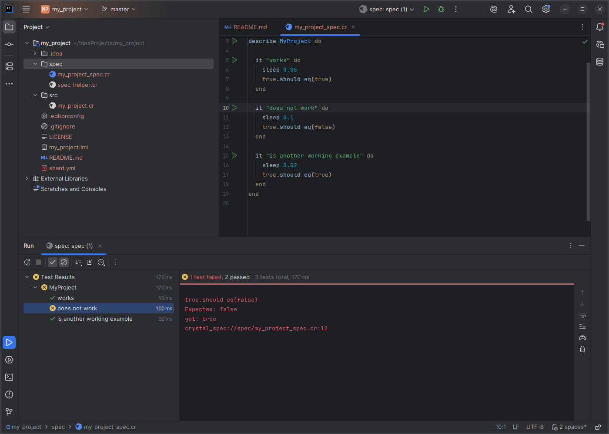
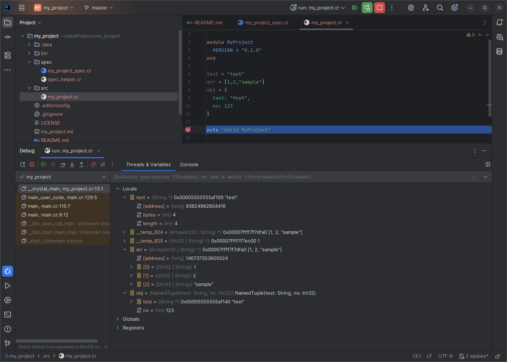

<p align="center">
  
</p>

# Fast Crystal Plugin for JetBrains IDEs

[](https://plugins.jetbrains.com/docs/intellij/build-number-ranges.html)
[](https://crystal-lang.org)
[](LICENSE)

Crystal language support for IntelliJ IDEA, WebStorm, RubyMine, and other JetBrains IDEs:
editing, navigation, completion, inspections, running, and debugging.
Built on a GrammarKit parser with StubIndex-backed resolution; requires
IntelliJ Platform 2026.1+ and a Crystal toolchain.

The repo ships a `stdlib-graph/` harness (`stdlibParseErrors`, `stdlibStructure`,
`stdlibBuildGraph`, `stdlibCheckFile`) that parses and resolves the entire Crystal
standard library through the plugin's own parser, so regressions show up as numbers
before they ship.

| Metric | Before | After |
|---|---|---|
| Parse time, 2.5 KB file ([catalyst](https://github.com/unurgunite/catalyst)`/src/catalyst/formatters/json.cr`) | 191 s | 94 ms |
| Project index, 522 `.cr` files ([catalyst](https://github.com/unurgunite/catalyst)) | 709 s, stuck at 95–99% | completes, IDE goes idle |
| Parse errors in `float.cr` (Crystal 1.21 stdlib) | present | 0 |
| `StackOverflowError` on self-referential assignments | crash | unknown type, no crash |

> [!NOTE]
> Early Beta — bugs are to be expected. Please [open an issue](https://github.com/unurgunite/fast-intellij-crystal/issues/new/choose)
> and fill out the template (current/expected examples are required).


*New project wizard.*


*Spec runner with gutter icons and result tree.*


*Debugging via lldb-dap: breakpoints, variables, stepping.*

## Features

### Syntax & Editing

- **Syntax Highlighting** — keywords, operators, strings with interpolation, numbers, symbols, regex, percent literals, heredocs, annotations, macros
- **Semantic Highlighting** — PSI-based: variables, methods, types, parameters, macro fresh vars
- **Keyword Block Highlighting** — cursor on `if`, `else`, `elsif`, `end`, `begin`, `rescue`, `ensure`, `case`, `when`, `def`, `class`, `module` highlights the related structural keywords of the enclosing block
- **Color Settings Page** — customizable colors for all token types
- **Code Folding** — blocks, methods, classes, multi-line comments, arrays, hashes
- **Brace Matching** — parentheses, brackets, braces, percent literal delimiters, `do`/`end` pairs
- **Auto-Insert** — closing quotes and brackets, `end` after block keywords, indentation after block openers
- **TODO Indexing** — highlights and indexes task comments

### Navigation

- **Go to Definition** (Ctrl+Click / Ctrl+B) — classes, modules, structs, enums, methods, instance and class variables (`@name`, `@@name`), DOT-call methods (`obj.method`, `Class.method`), intermediate namespace segments (`Inner` in `Outer::Inner.method`)
- **Go to Symbol** (Ctrl+Alt+Shift+N) — any symbol in the project
- **Go to Class** (Ctrl+N) — classes, modules, structs, enums
- **Find Usages** (Alt+F7) — methods, classes, instance and class variables within the enclosing class
- **Structure View** — nested types, methods, macros, constants
- **Parameter Info** (Ctrl+P) — method signatures at the call site: parenthesized, bare, and DOT-calls, `ClassName.new(...)`, overloads; project-wide via StubIndex
- **Quick Documentation** (Ctrl+Q) — doc comments with syntax-highlighted signature and Markdown; type names link to their documentation
- **Hover Popups** — inferred types for variables and parameters, documentation for definitions

### Code Completion

- **Context-Aware Completion** (Ctrl+Space) — static methods on classes, instance methods on variables via type inference, classes/methods/locals/stdlib types in free text, types after `:` in annotations, inside generics (`Array(<caret>)`) and unions (`String | <caret>`)
- **Overloaded Methods** — each overload appears as a separate entry with its parameter signature
- **Record Macro Support** — completion, parameter info, and argument inspections for record macros

### Refactoring

- **Rename** (Shift+F6) — in-place rename with preview dialog, Crystal identifier validation, and automatic compiler verification (`crystal build --no-codegen`)

### Code Formatting

- **Reformat Code** (Ctrl+Alt+L) — delegates to `crystal tool format` via stdin/stdout

### Run & Debug

- **Run Configurations** — `crystal run`, `build`, and `spec` with configurable arguments, environment variables, and working directory; right-click a `.cr` file to run it
- **Debugger** — breakpoints, variable inspection, and stepping via lldb-dap (DAP protocol)
- **Test Runner** — integrated spec runner with gutter icons, single-test execution, and result tree

### Code Generation

- **Live Templates** — 21 snippets for common Crystal patterns (class, module, struct, def, spec, etc.)

### Inspections

- **Type Checking** — argument types against parameter annotations (numeric autocasting, union and nilable types, overloads)
- **Argument Count** — argument count against method signatures (named args, splat, double-splat, defaults)
- **Unused Variables** — assigned-but-never-read local variables
- **Smaller Checks** — empty collection literals, untyped `lib fun` parameters, colon spacing (`x:Int32`), instance variable types, invalid single-quote strings

### Parser

- **Grammar Coverage** — classes, modules, structs, enums, methods, macros, control flow (including postfix modifiers), expressions with operator precedence, generics and unions, blocks, all literal forms with interpolation, `lib` bindings, pattern matching. Full rule set: [`Crystal.bnf`](src/main/kotlin/io/github/unurgunite/crystal/parser/Crystal.bnf)
- **StubIndex** — project-wide index for classes and methods (instant navigation even in large projects)
- **Error-Tolerant** — pin/recovery rules keep the parser working with incomplete code while typing

## Requirements

- **IntelliJ Platform** 2026.1 or later
- **Crystal** compiler (for formatting and compiler verification)
- **LLDB DAP** (optional, for debugging) — the `lldb-dap` binary must be installed

See [Installing Dependencies](#installing-dependencies) below for OS-specific instructions.

## Installation

### Installing Dependencies

This plugin depends on the **Crystal compiler** and (optionally) the **LLDB DAP** debugger.
Both binaries must be available in your `PATH`. The plugin additionally checks
`/usr/bin/lldb-dap` and `/usr/local/bin/lldb-dap` for auto-detection.

#### Linux — Arch / Manjaro / EndeavourOS / CachyOS

```bash
sudo pacman -S crystal shards lldb
```

The `lldb` package ships `lldb-dap`.

#### Linux — Debian / Ubuntu / Mint / Pop!_OS

Crystal (official install script):

```bash
curl -fsSL https://crystal-lang.org/install.sh | sudo bash
```

LLDB DAP — the default `lldb` package in Debian/Ubuntu repos is often too old or
does not ship `lldb-dap`. Use the official LLVM apt script for a current release
(23 as of September 2026):

```bash
wget https://apt.llvm.org/llvm.sh
chmod +x llvm.sh
sudo ./llvm.sh 23
sudo apt install lldb-23
```

The binary is installed as `/usr/bin/lldb-dap-23`. Either add it to your `PATH` as
`lldb-dap`, or symlink it so the plugin finds it automatically:

```bash
sudo ln -s /usr/bin/lldb-dap-23 /usr/bin/lldb-dap
```

#### Linux — Fedora / RHEL / Rocky

Crystal is not in the official Fedora repositories yet (native packaging is in
progress) — follow the [official install guide](https://crystal-lang.org/install/).

For the debugger:

```bash
sudo dnf install lldb
```

#### Linux — openSUSE

Crystal requires the OBS `devel:languages:crystal` repository:

```bash
sudo zypper ar -f https://download.opensuse.org/repositories/devel:/languages:/crystal/openSUSE_Tumbleweed/devel:languages:crystal.repo
sudo zypper --gpg-auto-import-keys install crystal
```

For the debugger:

```bash
sudo zypper install lldb
```

#### macOS

Crystal and LLDB via Homebrew (recommended). Note: Homebrew split LLDB out of
the `llvm` formula, so `llvm` alone no longer provides `lldb-dap`:

```bash
brew install crystal lldb
```

If `lldb-dap` is not on your `PATH` afterwards, symlink it so the plugin finds
it automatically (works on both Intel and Apple Silicon):

```bash
sudo ln -s "$(brew --prefix lldb)/bin/lldb-dap" /usr/local/bin/lldb-dap
```

The system `lldb` from Xcode Command Line Tools (`xcode-select --install`) also
provides `lldb-dap` (`xcrun -f lldb-dap`); Homebrew is the more predictable
option across macOS versions.

#### Windows

> Native Windows support is a work in progress. WSL2 is currently the most
> reliable option — follow the Debian/Ubuntu instructions above inside WSL.

For native installs (MSVC toolchain):

**1. Microsoft Visual C++ Build Tools**

Crystal on Windows requires the MSVC toolchain. Download the
[Visual Studio Build Tools installer](https://aka.ms/vs/17/release/vs_BuildTools.exe)
and select either:

- Workload: *Desktop development with C++*, or
- Individual component: *MSVC v143 - VS 2022 C++ x64/x86 build tools* plus
  *Windows 10 SDK* (or newer)

**2. Crystal**

Download a `*-windows-x86_64-msvc-*` build from the
[Crystal releases page](https://github.com/crystal-lang/crystal/releases/latest):

- `crystal-<version>-windows-x86_64-msvc-unsupported.exe` — GUI installer, adds Crystal to `PATH` automatically (recommended)
- `crystal-<version>-windows-x86_64-msvc-unsupported.zip` — portable archive

For a MinGW-w64-based alternative, see the
[official Crystal Windows guide](https://crystal-lang.org/install/on_windows/).

**3. LLDB DAP (for debugging)**

Download the latest LLVM Windows installer from the
[LLVM releases page](https://github.com/llvm/llvm-project/releases/latest):

- `LLVM-<VERSION>-win64.exe`

During installation, enable **"Add LLVM to the system PATH for all users"** so
`lldb-dap.exe` is discoverable by the plugin.

#### Verifying the installation

```bash
crystal --version
lldb-dap --help
```

If both commands work from a fresh shell, the plugin will pick up the toolchain
automatically.

### From JetBrains Marketplace

> **Note:** the Marketplace listing for Fast Crystal Plugin is pending publication. Until then, install from source below.

1. In your IDE, open *Settings → Plugins → Marketplace*
2. Search for **Fast Crystal Plugin**
3. Click **Install** and restart the IDE

### From Source

```bash
git clone https://github.com/unurgunite/fast-intellij-crystal.git
cd fast-intellij-crystal
./gradlew buildPlugin
```

The plugin ZIP will be at `build/distributions/`. Install via *Settings → Plugins → Install Plugin from Disk*.

To run a development IDE instance:

```bash
./gradlew runIde
```

## Architecture

```
Crystal.flex (JFlex)     →  Lexer (tokenization, highlighting)
Crystal.bnf (GrammarKit) →  Parser (PSI tree, structure)
Stubs                    →  StubIndex (project-wide search, Go to Definition)
type/                    →  Type kernel (inference + resolvers; leaf for completion, inspections, navigation)
editor/                  →  Editor behaviors (enter/brace/folding, commenter, typed)
```



Details: [`docs/ARCHITECTURE.md`](docs/ARCHITECTURE.md).

## Development

```bash
./gradlew build          # Compile + tests (no distributable ZIP)
./gradlew buildPlugin    # Build installable plugin ZIP (build/distributions/)
./gradlew generateLexer  # Regenerate lexer from Crystal.flex
./gradlew generateParser # Regenerate parser from Crystal.bnf
./gradlew runIde         # Launch development IDE
```

See [CONTRIBUTING.md](CONTRIBUTING.md) for workflow and conventions.

## Contributing

Issues and pull requests are welcome! Please read [CONTRIBUTING.md](CONTRIBUTING.md)
before opening an issue — it explains the three issue types and what
information we need.

- [Report a bug](https://github.com/unurgunite/fast-intellij-crystal/issues/new/choose) — something doesn't work as expected
- [Request a feature](https://github.com/unurgunite/fast-intellij-crystal/issues/new/choose) — a Crystal construct or IDE feature that isn't supported yet
- [Report a UX issue](https://github.com/unurgunite/fast-intellij-crystal/issues/new/choose) — something works but feels clunky

See [CONTRIBUTING.md](CONTRIBUTING.md) for guidelines on how to report issues and contribute.

## License

MIT — see [LICENSE](LICENSE)

This project includes **Crystal LLDB Formatters** (`src/main/resources/debugger/crystal_formatters.py`)
from the [Crystal Programming Language](https://github.com/crystal-lang/crystal),
licensed under the [Apache License 2.0](https://github.com/crystal-lang/crystal/blob/master/etc/lldb/crystal_formatters.py).
