# Architecture — Fast Crystal Plugin (`io.github.unurgunite.crystal`)

Module map and key pipelines. Behavioral details live in `docs/specs/`;
diagrams in `docs/diagrams/` (`.mmd` sources, `.svg` rendered — re-render with
`bash docs/diagrams/render.sh`, needs `mermaid-cli` + Chromium).

## Module map (`src/main/kotlin/.../crystal/`)

| Package | Responsibility | Key classes |
|---|---|---|
| root | Language plumbing, editor behaviors | `CrystalLanguage`, `CrystalFileType`, `CrystalFile`, `CrystalParserDefinition`, `CrystalEnterHandler` (+`Blocks`/`Brackets`/`Heredoc`), `CrystalFoldingBuilder`, `CrystalBraceMatcher`, `CrystalCommenter`, `CrystalStdlibCacheWarmup` |
| `lexer/` | JFlex tokenizer | `Crystal.flex`, `CrystalTokenTypes` |
| `parser/` | GrammarKit PEG grammar | `Crystal.bnf` (output committed in `src/main/gen/`) |
| `psi/` | References, resolution, mixins | `CrystalReference`, `CrystalDotCallReference`/`CrystalDotCallReceiver`, `CrystalNamespaceReference`, `CrystalLocalScopeResolve`, `CrystalPsiUtils`, stdlib resolvers |
| `stubs/` | Stub serialization + StubIndex | `CrystalClassIndex`, `CrystalMethodIndex`, `CrystalMethodByClassIndex`, `CrystalConstantIndex`, … |
| `completion/` | Dispatch, inference, lookups | `CrystalCompletionContributor` → `CrystalCompletionCases` → `CrystalDotCompletion`/`CrystalScopeCompletion`; `CrystalTypeInference`, `CrystalTypeHierarchy`, `CrystalLookupBuilders` |
| `navigation/` | Goto, usages, parameter info | `CrystalGotoDeclarationHandler`, Find Usages, `CrystalParameterInfoHandler`, `CrystalBareCallScanner` |
| `inspections/` | Type/arity/unused-var checks | `CrystalTypeCheckInspection`, `CrystalArgumentCountInspection`, `CrystalExpressionTypeResolver`, `CrystalOverloadEvaluator` |
| `highlighting/` | Lexer colors + annotator | `CrystalSyntaxHighlighter`, `CrystalAnnotator` |
| `documentation/` | Hover + Ctrl+Q | `CrystalDocumentationProvider` + `CrystalDoc*` splits |
| `run/` | Run configs + spec SMRunner | `CrystalRunConfiguration`, `CrystalSpecFileIndexer`, `CrystalTestEventsConverter` |
| `debugger/` | LLDB-DAP | `CrystalDebugRunState`, `crystal-lldb` adapter |
| `structure/` `formatting/` `sdk/` `project/` `refactoring/` | Structure view, `crystal tool format`, SDK detect, wizard, rename | — |

## Pipelines

### Go to Definition / references

Mixins expose `getReference()` (no `PsiReferenceContributor` — it misses leaf
tokens): direct references → `CrystalReference`; `obj.method` → `CrystalDotCallReference`;
`A::B` segments → `CrystalNamespaceReference`.

1. `CrystalReference`: local scope (`CrystalLocalScopeResolve`, file-bounded) →
   `StubIndex` (class/method/constant) → bare-call stdlib tiebreak (enclosing class
   wins: `File.exists?`, not `Dir.exists?`) → bounded stdlib fallback.
2. `CrystalDotCallReference`: `CrystalDotCallReceiver` scans `prevSibling` of
   `dot_call_access` (CONSTANT / namespace / inferred identifier / `self` / literal) →
   per union member via `CrystalMethodByClassIndex`; `.new` follows
   `def self.new` > `record` > `def initialize`; unknown receiver → `null`
   (project-only name fallback, never stdlib).
3. Stdlib: `CrystalStdlibFileResolve` parses only the conventional home file
   (`ClassName` → `class_name.cr`); else cached `SymbolLoc` table from
   `CrystalStdlibTextScan` (stdlib root only, materialized fresh each resolve).
   Warmed post-startup by `CrystalStdlibCacheWarmup`.

### Completion

Contributor → `CrystalCompletionCases` (suppress in strings/numbers) → terminal
contexts (`:` types, `@[` annotations, `CONSTANT.`/`ident.` DOT-calls,
`CONSTANT::` nested types) or free text. DOT-static: indexed methods + `new`
fallbacks; DOT-instance: `CrystalTypeInference` (params → assignments → literals →
return types, depth ≤ 5) across union members; hierarchy walk with fading priority
(`CrystalMethodByClassIndex`). Free text: block params > params > for-vars >
locals > class vars, `@`/`@@` handling, uppercase adds stdlib types.

### Inspections

Call shapes → `CrystalCallArguments` (+`CrystalDotCallScan`, splat expansion,
binary-op ambiguity guard) → candidates (`CrystalMethodIndex` / `ByClass`) →
record fast path → arity (`CrystalOverloadEvaluator`: any accepting overload
silences) → per-arg types (`CrystalExpressionTypeResolver`, depth ≤ 16) →
`CrystalTypeCompatibility` (alias expansion, union/nilable, numeric autocast,
known-builtin guard) → `GENERIC_ERROR` on innermost expression iff **all**
overloads reject. Unused vars: collect assignments/reads → conditional-branch
windows → `WEAK WARNING`.

### Spec run / debug

Gutter → Run/Build/Spec configs → `CrystalTestRunState` pre-indexes
(`CrystalSpecFileIndexer`: `describe/context/it` → `fullName → locations`) →
`crystal spec -v --no-color --junit_output` → `CrystalTestEventsConverter.Parser`
(verbose tree → `Failures:` section → JUnit timing) → SMRunner events with
`crystal_spec://file:line` URLs → `CrystalTestLocator` for click-to-source.
Debug: compile `bin/<name> --debug` → `crystal-lldb` over `lldb-dap`.

## Invariants (see AGENTS.md for the full list)

- **StubIndex-only runtime lookups** — no `FileTypeIndex`/project VFS walks
  (90s+ stalls); stdlib fallback bounded to the stdlib root.
- **Generated sources committed** — `src/main/gen/`; BNF change ⇒ regenerate +
  parser golden test, no `PsiErrorElement`.
- **PEG ordering** — longer alternative first, no `recoverWhile`; context
  keywords stay IDENTIFIER-based.
- **Definition plumbing** — mixins + `GotoDeclarationHandler` for DOT-calls only;
  constructor order `self.new` > `record` > `initialize`.
